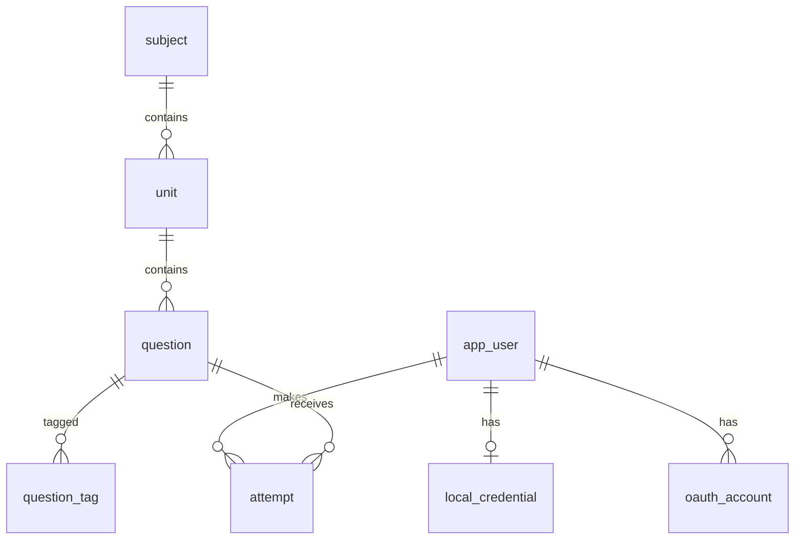

# 01 資料表結構與 Flyway migration

第一階段需要 3 個 migration、7 張表（§3），DDL 已用 Flyway 11.14.1 在 MySQL 8.0（8.0.46）與 8.4（8.4.11）上實際執行成功；要用哪個小版本見 Q-G6。其餘資料表要等對應的待決問題決定後才建立（§5），第二～七階段只列草案（§6）。

## 1. 範圍

- 只涵蓋**系統 MySQL**。練習用 MySQL 與系統 MySQL 分開（文件：各類判題與技術／測資型），練習資料集不由本 repo 的 Flyway 管理。
- DDL 內以 `-- 〔待決 Q-xx〕` 開頭的欄位是被註解掉的候選欄位：決定需要時取消註解。若該 migration 已套用到任何環境，改為新增 migration 以 `ALTER TABLE` 加入。
- 文件列出的題目欄位（`judge_type`、`difficulty`、`tags`、`device`、`version`、`source`、`license`、`payload`）全部出現在 §3；其他欄位的理由寫在各表下方。

## 2. Flyway 與命名慣例

Flyway 規則：

- 位置：`backend/src/main/resources/db/migration/`
- 檔名：`V{n}__{snake_case_description}.sql`，n 從 1 連續遞增。
- 已套用的 migration 不得修改（Flyway 會比對 checksum），修正一律新增 migration。
- 依賴：`spring-boot-starter-flyway` + `org.flywaydb:flyway-mysql`（Spring Boot 4.0.3 管理 Flyway 11.14.1）。
- Hibernate（若 Q-G3 選 JPA）不得產生或修改 schema。
- 整合測試用 Testcontainers 執行全部 migration，映像標籤依 Q-G6（`mysql:8.0` 或 `mysql:8.4`）。
- 實測紀錄見本節末。

以下是**規格慣例**（規劃文件沒寫，由本規格訂定，可否決）：

| 項目 | 慣例 | 理由 |
| --- | --- | --- |
| 表名 | snake_case 單數；使用者表叫 `app_user` | 避免與 `mysql.user` 及 SQL 關鍵字混淆 |
| 主鍵 | `id BIGINT NOT NULL AUTO_INCREMENT` | 對應 Java `long` |
| 整數 | 不用 `UNSIGNED` | Java 沒有無號整數，避免映射成更寬的型別 |
| 約束命名 | `uk_<表>_<欄>`、`idx_<表>_<欄>`、`fk_<表>_<參照表>` | 錯誤訊息可讀 |
| 字元集 | 每張表明寫 `utf8mb4` / `utf8mb4_0900_ai_ci`（8.0.46 與 8.4.11 的預設值，已確認） | 中文與 emoji |
| 精確比對 | 識別碼、雜湊、UUID 用 `utf8mb4_bin` 或 `ascii_bin` | 預設定序不分大小寫與重音 |
| 時間 | `DATETIME(6)` 存 UTC，對應 Java `Instant`；由應用程式寫入（注入 `Clock`），不用資料庫預設值 | 文件：資料庫存 UTC；測試可固定時間 |
| 日期 | 統計日期用 `DATE`，以 `Asia/Taipei` 切日 | 文件：統計以 Asia/Taipei 切日 |
| 列舉 | 用 `VARCHAR`，不用 `ENUM`、不加 `CHECK` | `judge_type` 要能擴充（文件：新增題型不需改動既有程式）；其他列舉的值域尚待決定 |
| JSON | MySQL `JSON` 型別 | 文件：payload 用 MySQL JSON 欄位 |
| 刪除 | 第一階段不做軟刪除；題目下架用 `question.status` | 見 Q-M10、Q-I4 |

JDBC 連線建議加 `connectionTimeZone=UTC&forceConnectionTimeZoneToSession=true`，讓 `Instant` 與 `DATETIME(6)` 互轉不受 JVM 時區影響；T05 必須以測試證明寫入與讀出的時間一致。

實測方式（2026-09-25，供重現）：用 Flyway 11.14.1 官方映像（`redgate/flyway:11.14.1`）分別連線 `mysql:8.0`（8.0.46）與 `mysql:8.4`（8.4.11）容器執行 `migrate`。兩個版本上，V1～V3 加上 §5 全部 6 個條件式 migration 共 9 個都套用成功；把所有 `〔待決〕` 欄位取消註解後再跑一次也成功；兩個版本建出的索引與外鍵完全相同，也和本檔一致。8.0 沒有任何警告；8.4 會印出以下警告，不影響執行：

```text
WARNING: Using MySQL 8.4 which is newer than the version Flyway has been verified with. The latest verified version of MySQL is 8.1.
```

T04 要在 PR 中記錄 Spring Boot 啟動時是否出現這行警告（Q-G6 選 8.4 時會出現）。

## 3. 第一階段 migration

### V1 使用者

<!-- flyway: V1__create_user_tables.sql -->
```sql
CREATE TABLE app_user (
    id          BIGINT      NOT NULL AUTO_INCREMENT,
    -- 〔待決 Q-A4〕display_name VARCHAR(50) NULL,
    -- 〔待決 Q-A7〕email VARCHAR(254) NULL,  -- 決定合併帳號時加，並加 UNIQUE KEY uk_app_user_email (email)
    -- 〔待決 Q-A8〕role VARCHAR(16) NOT NULL,
    created_at  DATETIME(6) NOT NULL,
    updated_at  DATETIME(6) NOT NULL,
    PRIMARY KEY (id)
) ENGINE = InnoDB DEFAULT CHARSET = utf8mb4 COLLATE = utf8mb4_0900_ai_ci;

CREATE TABLE local_credential (
    user_id        BIGINT       NOT NULL,
    login_id       VARCHAR(254) NOT NULL,  -- 〔Q-A4〕email 或使用者名稱；依定序不分大小寫比對
    password_hash  VARCHAR(255) NOT NULL,  -- DelegatingPasswordEncoder 格式，例如 {bcrypt}$2a$10$...
    created_at     DATETIME(6)  NOT NULL,
    updated_at     DATETIME(6)  NOT NULL,
    PRIMARY KEY (user_id),
    UNIQUE KEY uk_local_credential_login_id (login_id),
    CONSTRAINT fk_local_credential_app_user FOREIGN KEY (user_id) REFERENCES app_user (id)
) ENGINE = InnoDB DEFAULT CHARSET = utf8mb4 COLLATE = utf8mb4_0900_ai_ci;

CREATE TABLE oauth_account (
    id                BIGINT       NOT NULL AUTO_INCREMENT,
    user_id           BIGINT       NOT NULL,
    provider          VARCHAR(32)  NOT NULL,  -- 第一階段只有 google
    provider_subject  VARCHAR(255) CHARACTER SET utf8mb4 COLLATE utf8mb4_bin NOT NULL,  -- Google ID token 的 sub
    -- 〔待決 Q-A2／Q-A7〕email VARCHAR(254) NULL,  -- Google 提供的 email，白名單或合併帳號需要時才存
    created_at        DATETIME(6)  NOT NULL,
    updated_at        DATETIME(6)  NOT NULL,
    PRIMARY KEY (id),
    UNIQUE KEY uk_oauth_account_provider_subject (provider, provider_subject),
    KEY idx_oauth_account_user (user_id),
    CONSTRAINT fk_oauth_account_app_user FOREIGN KEY (user_id) REFERENCES app_user (id)
) ENGINE = InnoDB DEFAULT CHARSET = utf8mb4 COLLATE = utf8mb4_0900_ai_ci;
```

- 文件：登入方式為「Google 登入 + 自建帳密」。帳密與 Google 身分分表存放，同一個 `app_user` 可同時擁有兩者；是否合併由 Q-A7 決定，schema 兩種做法都支援。
- Google 使用者以 `sub` 識別，不以 email 識別（email 可變更）。
- 登入狀態（session 或 refresh token）的表見 §5.1。

### V2 題庫

<!-- flyway: V2__create_question_bank_tables.sql -->
```sql
CREATE TABLE subject (
    id          BIGINT      NOT NULL AUTO_INCREMENT,
    code        VARCHAR(32) NOT NULL,  -- 〔Q-M1〕例如 mysql；題目檔以此參照
    name        VARCHAR(64) NOT NULL,  -- 顯示名稱〔Q-F2〕若介面雙語需擴充
    sort_order  INT         NOT NULL,
    created_at  DATETIME(6) NOT NULL,
    updated_at  DATETIME(6) NOT NULL,
    PRIMARY KEY (id),
    UNIQUE KEY uk_subject_code (code)
) ENGINE = InnoDB DEFAULT CHARSET = utf8mb4 COLLATE = utf8mb4_0900_ai_ci;

CREATE TABLE unit (
    id          BIGINT       NOT NULL AUTO_INCREMENT,
    subject_id  BIGINT       NOT NULL,
    code        VARCHAR(64)  NOT NULL,  -- 科目內唯一
    name        VARCHAR(128) NOT NULL,
    sort_order  INT          NOT NULL,
    created_at  DATETIME(6)  NOT NULL,
    updated_at  DATETIME(6)  NOT NULL,
    PRIMARY KEY (id),
    UNIQUE KEY uk_unit_subject_code (subject_id, code),
    CONSTRAINT fk_unit_subject FOREIGN KEY (subject_id) REFERENCES subject (id)
) ENGINE = InnoDB DEFAULT CHARSET = utf8mb4 COLLATE = utf8mb4_0900_ai_ci;

CREATE TABLE question (
    id            BIGINT       NOT NULL AUTO_INCREMENT,
    question_key  VARCHAR(128) CHARACTER SET utf8mb4 COLLATE utf8mb4_bin NOT NULL,  -- 〔Q-I3〕題庫中的穩定識別碼
    unit_id       BIGINT       NOT NULL,
    judge_type    VARCHAR(32)  NOT NULL,  -- 已註冊的 Judge 類型，第一階段為 choice、fill
    stem          TEXT         NOT NULL,  -- 題幹〔Q-M8〕格式
    difficulty    SMALLINT     NOT NULL,  -- 〔Q-M3〕尺度與是否必填
    device        VARCHAR(16)  NOT NULL,  -- 〔Q-M4〕mobile、desktop
    version       VARCHAR(64)  NULL,      -- 適用版本，例如 MySQL 8.0〔Q-M5〕
    source        VARCHAR(512) NOT NULL,  -- 出處〔Q-I8〕
    license       VARCHAR(64)  NOT NULL,  -- 授權〔Q-I8〕
    payload       JSON         NOT NULL,  -- 題型專屬資料（03-judge.md），含答案，不得直接回傳前端
    status        VARCHAR(16)  NOT NULL,  -- ACTIVE；其他值見 Q-M10
    revision      INT          NOT NULL,  -- 新題為 1，內容每變動一次 +1
    content_hash  CHAR(64)     CHARACTER SET ascii COLLATE ascii_bin NOT NULL,  -- 題目檔正規化後的 SHA-256（hex）
    -- 〔待決 Q-M7〕language VARCHAR(16) NOT NULL,  -- zh-TW、en
    -- 〔待決 Q-M9〕explanation TEXT NULL,
    created_at    DATETIME(6)  NOT NULL,
    updated_at    DATETIME(6)  NOT NULL,
    PRIMARY KEY (id),
    UNIQUE KEY uk_question_key (question_key),
    KEY idx_question_unit_status (unit_id, status),
    CONSTRAINT fk_question_unit FOREIGN KEY (unit_id) REFERENCES unit (id)
) ENGINE = InnoDB DEFAULT CHARSET = utf8mb4 COLLATE = utf8mb4_0900_ai_ci;

CREATE TABLE question_tag (
    question_id  BIGINT      NOT NULL,
    tag          VARCHAR(64) NOT NULL,
    PRIMARY KEY (question_id, tag),
    KEY idx_question_tag_tag (tag),
    CONSTRAINT fk_question_tag_question FOREIGN KEY (question_id) REFERENCES question (id) ON DELETE CASCADE
) ENGINE = InnoDB DEFAULT CHARSET = utf8mb4 COLLATE = utf8mb4_0900_ai_ci;
```

- 文件：資料分三層「科目 → 單元 → 題目」。題目只存 `unit_id`，科目經由單元取得。
- `code`：題目檔以代碼參照科目與單元（見 03-judge.md §3）；科目與單元的資料來源見 Q-M2。
- `question_key`、`revision`、`content_hash`：文件的流程是「CI 自動匯入」，重複匯入必須是冪等的。匯入時以 `question_key` 找到同一題，`content_hash` 不同才更新並把 `revision` 加 1。`content_hash` 的算法見 03-judge.md §3.3。
- `revision` 同時記在每筆作答（V3），題目修正後舊紀錄仍知道當時作答的版本（Q-M11）。
- `stem` 是 `TEXT`（最多 65,535 bytes），題目檔的 JSON Schema 因此限制 `stem` 最多 16,000 字元。
- `tags` 用 `question_tag` 表，不用 JSON 陣列：任何資料存取技術（Q-G3）都能直接查詢。

### V3 作答紀錄

<!-- flyway: V3__create_attempt_table.sql -->
```sql
CREATE TABLE attempt (
    id                 BIGINT      NOT NULL AUTO_INCREMENT,
    user_id            BIGINT      NOT NULL,
    question_id        BIGINT      NOT NULL,
    question_revision  INT         NOT NULL,  -- 作答當下的 question.revision
    client_attempt_id  CHAR(36)    CHARACTER SET ascii COLLATE ascii_bin NOT NULL,  -- 前端產生的 UUID，重送時去重
    answer             JSON        NOT NULL,  -- 使用者提交內容（03-judge.md）
    verdict            VARCHAR(16) NOT NULL,  -- 第一階段：CORRECT、WRONG
    feedback           JSON        NULL,      -- Judge 回傳的回饋細節
    -- 〔待決 Q-P7〕client_duration_ms INT NULL,
    created_at         DATETIME(6) NOT NULL,  -- 伺服器判題完成的時間（UTC）
    PRIMARY KEY (id),
    UNIQUE KEY uk_attempt_user_client_attempt (user_id, client_attempt_id),
    KEY idx_attempt_user_created (user_id, created_at),
    KEY idx_attempt_user_question (user_id, question_id),
    KEY idx_attempt_question (question_id),
    CONSTRAINT fk_attempt_app_user FOREIGN KEY (user_id) REFERENCES app_user (id),
    CONSTRAINT fk_attempt_question FOREIGN KEY (question_id) REFERENCES question (id)
) ENGINE = InnoDB DEFAULT CHARSET = utf8mb4 COLLATE = utf8mb4_0900_ai_ci;
```

- 文件：原始作答紀錄是統計的來源；活躍日定義為「當天有作答」。
- `client_attempt_id`：文件指出手機網路可能不穩，且規劃離線作答後同步；同一次作答重送時以 `(user_id, client_attempt_id)` 去重，不會重複計分。
- 解答不存在 `attempt`，需要時由 `question.payload` 取得。

## 4. 關聯圖與索引用途



| 查詢 | 使用的索引 |
| --- | --- |
| 以 Google `sub` 找使用者 | `uk_oauth_account_provider_subject` |
| 以登入識別找帳密 | `uk_local_credential_login_id` |
| 匯入時以識別碼找題目 | `uk_question_key` |
| 列出單元內可出題的題目 | `idx_question_unit_status` |
| 依標籤找題目（日後，Q-M6） | `idx_question_tag_tag` |
| 作答重送去重 | `uk_attempt_user_client_attempt` |
| 使用者某段時間的作答（歷史、統計、今日新題數） | `idx_attempt_user_created` |
| 使用者是否做過某題、答錯過哪些題 | `idx_attempt_user_question` |
| 單題答對率（日後題目品質管理，Q-L10） | `idx_attempt_question` |

「今天」的查詢一律先在應用程式把 `Asia/Taipei` 的當日換算成 UTC 區間，再以 `created_at >= ? AND created_at < ?` 查詢，才能用到 `idx_attempt_user_created`。等餐模式的選題規則（Q-P1）決定後，若需要其他索引，以新 migration 加入。

## 5. 條件式 migration

以下 migration 只有在對應問題決定「要」之後才建立，版本號接在當時最後一個 migration 之後。DDL 都已在 8.0.46 與 8.4.11 實測。

### 5.1 登入狀態（Q-A1）

選 a（Spring Session JDBC）時，一字不改地使用 `spring-session-jdbc` 4.0.2 內附的 `org/springframework/session/jdbc/schema-mysql.sql`，並設定 `spring.session.jdbc.initialize-schema=never`（schema 只由 Flyway 建立）。表名維持大寫，Spring Session 以大寫表名查詢，Linux 上的 MySQL 表名區分大小寫。

<!-- flyway-conditional: V{n}__create_spring_session_tables.sql -->
```sql
CREATE TABLE SPRING_SESSION (
	PRIMARY_ID CHAR(36) NOT NULL,
	SESSION_ID CHAR(36) NOT NULL,
	CREATION_TIME BIGINT NOT NULL,
	LAST_ACCESS_TIME BIGINT NOT NULL,
	MAX_INACTIVE_INTERVAL INT NOT NULL,
	EXPIRY_TIME BIGINT NOT NULL,
	PRINCIPAL_NAME VARCHAR(100),
	CONSTRAINT SPRING_SESSION_PK PRIMARY KEY (PRIMARY_ID)
) ENGINE=InnoDB ROW_FORMAT=DYNAMIC;

CREATE UNIQUE INDEX SPRING_SESSION_IX1 ON SPRING_SESSION (SESSION_ID);
CREATE INDEX SPRING_SESSION_IX2 ON SPRING_SESSION (EXPIRY_TIME);
CREATE INDEX SPRING_SESSION_IX3 ON SPRING_SESSION (PRINCIPAL_NAME);

CREATE TABLE SPRING_SESSION_ATTRIBUTES (
	SESSION_PRIMARY_ID CHAR(36) NOT NULL,
	ATTRIBUTE_NAME VARCHAR(200) NOT NULL,
	ATTRIBUTE_BYTES BLOB NOT NULL,
	CONSTRAINT SPRING_SESSION_ATTRIBUTES_PK PRIMARY KEY (SESSION_PRIMARY_ID, ATTRIBUTE_NAME),
	CONSTRAINT SPRING_SESSION_ATTRIBUTES_FK FOREIGN KEY (SESSION_PRIMARY_ID) REFERENCES SPRING_SESSION(PRIMARY_ID) ON DELETE CASCADE
) ENGINE=InnoDB ROW_FORMAT=DYNAMIC;
```

選 c（JWT + refresh token）時，只存 refresh token 的雜湊，不存明文：

<!-- flyway-conditional: V{n}__create_refresh_token_table.sql -->
```sql
CREATE TABLE refresh_token (
    id          BIGINT      NOT NULL AUTO_INCREMENT,
    user_id     BIGINT      NOT NULL,
    token_hash  CHAR(64)    CHARACTER SET ascii COLLATE ascii_bin NOT NULL,  -- SHA-256（hex）
    expires_at  DATETIME(6) NOT NULL,
    revoked_at  DATETIME(6) NULL,
    created_at  DATETIME(6) NOT NULL,
    PRIMARY KEY (id),
    UNIQUE KEY uk_refresh_token_token_hash (token_hash),
    KEY idx_refresh_token_user (user_id),
    CONSTRAINT fk_refresh_token_app_user FOREIGN KEY (user_id) REFERENCES app_user (id)
) ENGINE = InnoDB DEFAULT CHARSET = utf8mb4 COLLATE = utf8mb4_0900_ai_ci;
```

選 b（記憶體 session）不需要資料表。

### 5.2 等餐模式場次（Q-P3 選 a）

<!-- flyway-conditional: V{n}__create_practice_session_tables.sql -->
```sql
CREATE TABLE practice_session (
    id           BIGINT      NOT NULL AUTO_INCREMENT,
    user_id      BIGINT      NOT NULL,
    mode         VARCHAR(16) NOT NULL,  -- MEAL（等餐模式）
    status       VARCHAR(16) NOT NULL,  -- IN_PROGRESS、FINISHED；是否有 EXPIRED 見 Q-P3
    -- 〔待決 Q-P2〕question_limit INT NULL,
    -- 〔待決 Q-P2〕time_limit_seconds INT NULL,
    started_at   DATETIME(6) NOT NULL,
    finished_at  DATETIME(6) NULL,
    PRIMARY KEY (id),
    KEY idx_practice_session_user_status (user_id, status),
    CONSTRAINT fk_practice_session_app_user FOREIGN KEY (user_id) REFERENCES app_user (id)
) ENGINE = InnoDB DEFAULT CHARSET = utf8mb4 COLLATE = utf8mb4_0900_ai_ci;

CREATE TABLE practice_session_item (
    session_id   BIGINT NOT NULL,
    seq          INT    NOT NULL,  -- 1 起算的出題順序
    question_id  BIGINT NOT NULL,
    attempt_id   BIGINT NULL,      -- 作答後填入
    PRIMARY KEY (session_id, seq),
    UNIQUE KEY uk_practice_session_item_attempt (attempt_id),
    KEY idx_practice_session_item_question (question_id),
    CONSTRAINT fk_practice_session_item_practice_session FOREIGN KEY (session_id) REFERENCES practice_session (id) ON DELETE CASCADE,
    CONSTRAINT fk_practice_session_item_question FOREIGN KEY (question_id) REFERENCES question (id),
    CONSTRAINT fk_practice_session_item_attempt FOREIGN KEY (attempt_id) REFERENCES attempt (id)
) ENGINE = InnoDB DEFAULT CHARSET = utf8mb4 COLLATE = utf8mb4_0900_ai_ci;
```

- 場次的題目清單在建立時就固定，續做時照原順序出題（文件：隨時離開可續做）。
- 「每位使用者同時只有一個進行中場次」是否成立見 Q-P3；若成立，在應用程式檢查即可。

### 5.3 每日統計（Q-S1 選 a 或 b，且 Q-S2 決定要做）

<!-- flyway-conditional: V{n}__create_daily_stats_table.sql -->
```sql
CREATE TABLE daily_stats (
    user_id        BIGINT      NOT NULL,
    stat_date      DATE        NOT NULL,  -- Asia/Taipei 的日期
    subject_id     BIGINT      NOT NULL,
    attempt_count  INT         NOT NULL,
    correct_count  INT         NOT NULL,
    -- 〔待決 Q-P7〕study_seconds INT NOT NULL,
    updated_at     DATETIME(6) NOT NULL,
    PRIMARY KEY (user_id, stat_date, subject_id),
    KEY idx_daily_stats_subject (subject_id),
    CONSTRAINT fk_daily_stats_app_user FOREIGN KEY (user_id) REFERENCES app_user (id),
    CONSTRAINT fk_daily_stats_subject FOREIGN KEY (subject_id) REFERENCES subject (id)
) ENGINE = InnoDB DEFAULT CHARSET = utf8mb4 COLLATE = utf8mb4_0900_ai_ci;
```

- 文件：記錄每日刷題數（分科）、正確率、學習時間、活躍日熱度圖、連續天數。正確率 = `correct_count / attempt_count`；活躍日 = 當天任一科 `attempt_count > 0`；熱度圖與連續天數由此表依日期彙總，不另外存。
- 表名 `daily_stats` 沿用文件的名稱。

### 5.4 每日新題上限（Q-P6 決定要做）

<!-- flyway-conditional: V{n}__create_daily_new_limit.sql -->
```sql
ALTER TABLE subject ADD COLUMN default_daily_new_limit INT NULL;  -- 〔Q-P6〕各科預設值

CREATE TABLE user_subject_setting (
    user_id          BIGINT      NOT NULL,
    subject_id       BIGINT      NOT NULL,
    daily_new_limit  INT         NOT NULL,  -- 使用者調整後的上限（文件：上限可由使用者調整）
    updated_at       DATETIME(6) NOT NULL,
    PRIMARY KEY (user_id, subject_id),
    KEY idx_user_subject_setting_subject (subject_id),
    CONSTRAINT fk_user_subject_setting_app_user FOREIGN KEY (user_id) REFERENCES app_user (id),
    CONSTRAINT fk_user_subject_setting_subject FOREIGN KEY (subject_id) REFERENCES subject (id)
) ENGINE = InnoDB DEFAULT CHARSET = utf8mb4 COLLATE = utf8mb4_0900_ai_ci;
```

### 5.5 題目錯誤回報（Q-P8 決定要做）

<!-- flyway-conditional: V{n}__create_question_report_table.sql -->
```sql
CREATE TABLE question_report (
    id                 BIGINT        NOT NULL AUTO_INCREMENT,
    question_id        BIGINT        NOT NULL,
    question_revision  INT           NOT NULL,
    user_id            BIGINT        NOT NULL,
    reason             VARCHAR(32)   NOT NULL,  -- 〔Q-P8〕原因選項
    comment            VARCHAR(1000) NULL,      -- 〔Q-P8〕是否需要文字說明
    status             VARCHAR(16)   NOT NULL,  -- OPEN、RESOLVED
    created_at         DATETIME(6)   NOT NULL,
    PRIMARY KEY (id),
    KEY idx_question_report_question_status (question_id, status),
    KEY idx_question_report_user (user_id),
    CONSTRAINT fk_question_report_question FOREIGN KEY (question_id) REFERENCES question (id),
    CONSTRAINT fk_question_report_app_user FOREIGN KEY (user_id) REFERENCES app_user (id)
) ENGINE = InnoDB DEFAULT CHARSET = utf8mb4 COLLATE = utf8mb4_0900_ai_ci;
```

## 6. 第二～七階段草案（尚不建表）

各階段開始前，依屆時的決定定稿並新增 migration。

| 階段 | 需要的資料 | 草案 | 相關待決 |
| --- | --- | --- | --- |
| 2 正則 | 無新表；作答與未通過的測資存在 `attempt.answer`／`feedback` | — | Q-L2、Q-L3 |
| 3 SQL | 系統資料庫無新表；練習資料庫另外管理 | — | Q-L4 |
| 4 間隔重複 | 每位使用者每題的排程狀態 | `review_state`：`user_id`、`question_id`、`algorithm`、`due_at`、演算法狀態（SM-2 為 repetitions、interval_days、ease_factor）、`last_reviewed_at`；索引 `(user_id, due_at)` | Q-L1、Q-L5、Q-L6 |
| 5 打字 | 依裝置分開的排行榜（文件） | `attempt` 加作答裝置欄位；速度與正確率另存欄位或 `typing_result` 表以便排序 | Q-L7 |
| 6 沙箱 | 容器生命週期、每帳號一個沙箱、狀態頁的平均啟動時間（文件） | `sandbox_session`：`user_id`、`question_id`、`container_id`、`status`、`requested_at`、`ready_at`、`ended_at`、`end_reason`；「每人一個進行中」可用 generated column + `UNIQUE` 實作 | Q-L8 |
| 6 操作回放 | 終端機錄影（文件） | `terminal_recording`：`session_id`、格式、存放位置 | Q-L8 |
| 7 AI 批改 | 回饋存在 `attempt.feedback`；若非同步需要工作佇列表 | — | Q-J7、Q-L9 |
| 未排入 | 題目品質自動管理（自動標記、下架）、狀態頁的判題耗時 | `question.status` 新增值、`question_flag` 表、`attempt` 加判題耗時 | Q-L10、Q-M10 |
| 未排入 | 用餐時間推播、家庭排行榜加入設定、每週報告 email 設定 | `push_subscription` 等 | Q-L11 |
